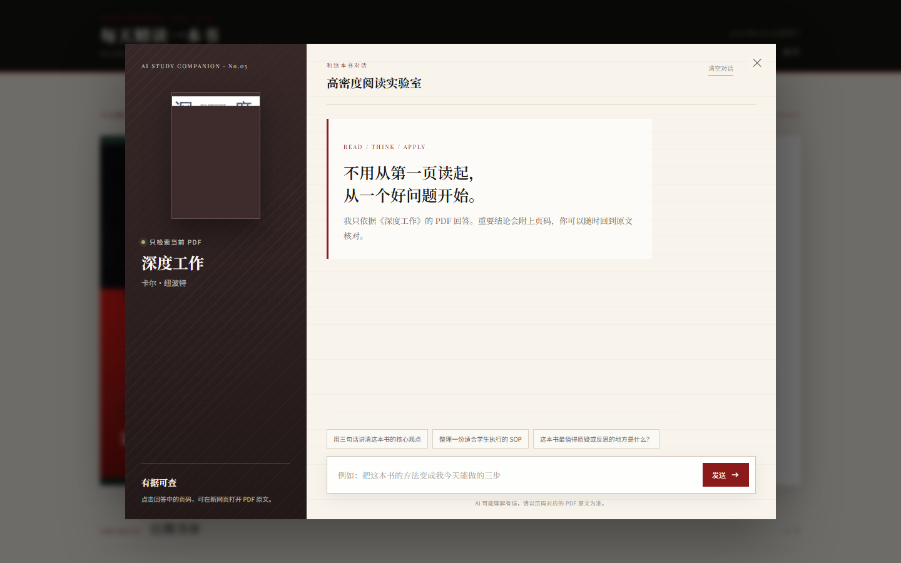

<div align="center">
  <h1>每天精读一本书</h1>
  <p><strong>面向学生的高信息密度 AI 阅读应用</strong></p>
  <p>不必从第一页读起，从一个好问题开始。</p>
  <p>
    <a href="https://dailybooks-three.vercel.app/">在线体验</a>
    ·
    <a href="./TODO.md">产品路线图</a>
  </p>
</div>

---

## 为什么做这个项目？

很多人并不是不想学习，而是没有足够时间读完一本书。

传统书摘虽然能快速提供结论，却经常脱离原文；通用 AI 可以回答问题，但可能混入其他知识，用户很难判断答案是否可靠。

我希望做一个更适合学生和高密度学习者的阅读工具：

- 快速了解一本书的核心观点；
- 把知识转化成能够立即执行的 SOP；
- 可以直接向当前书籍提问；
- 每个重要结论都能回到 PDF 原文核对。

## 产品方案

「每天精读一本书」目前收录了 58 本书的精读内容，覆盖认知心理、个人成长、学习方法、商业创新等 10 个分类。

核心功能是“当前书籍 AI 伴读”：

1. 将每本 PDF 提取为带页码的文本片段；
2. 根据问题只检索当前打开的书；
3. 将相关内容发送给 DeepSeek 生成回答；
4. 通过流式传输实时显示结果；
5. 为关键结论标注 PDF 页码，点击即可查看原文。

这让 AI 不只是给出答案，也能说明答案来自哪里。



## 核心能力

- **58 本精读书库**：书评、核心观点、行动建议、封面与 PDF。
- **当前书籍 RAG**：不同书籍的知识相互隔离，减少内容混淆。
- **可追溯引用**：回答附带 PDF 页码，可以直接打开原文。
- **流式 AI 对话**：通过 Vercel Function 安全调用 DeepSeek API。
- **本地内容后台**：支持封面搜索、批量 PDF 匹配和一键发布。
- **多端适配**：支持电脑和手机浏览、提问与在线阅读。

## 技术概览

`HTML / CSS / JavaScript` · `Vercel Functions` · `DeepSeek API` · `PDF 文本提取` · `当前书籍检索` · `SSE 流式传输` · `GitHub 自动部署`

---

## ✨ 功能特性

### 内容
- 📚 **58 本精选书籍**：覆盖认知心理、个人成长、商业创新、金融经济等 10 个分类
- 📖 **深度书评 + 核心要点 + 行动建议**：每本书都有完整的精读结构
- 🔍 **实时搜索 + 标签筛选**：按书名/作者/内容搜索，按标签分类浏览

### 交互
- 🎲 **换一本推荐**：一键随机切换今日推荐
- 🖼️ **生成分享卡片**：一键生成精美 1:1 分享图，支持下载到本地
- ⌨️ **键盘快捷键**：空格播放、R 换一本、Esc 关闭弹窗
- 🎨 **4 套主题切换**：默认/森系绿/科技蓝/活力橙，记忆用户偏好

### 无障碍 & 体验
- 📱 **完整移动端适配**：手机/平板/桌面响应式
- ⌨️ **键盘可访问**：Tab 焦点可见 + 跳转链接
- 🔍 **SEO 优化**：Open Graph / Twitter Card / favicon

### 管理
- 📝 **可视化后台**：[admin.html](admin.html) 一键填表，自动 commit 到 GitHub。封面搜索通过本地轻量服务运行，无需构建。
- 🖼️ **自动封面**：豆瓣优先，Google Books / Open Library / 百度兜底；先预览确认，再上传到 GitHub。
- 📦 **批量 PDF**：选择 ZIP 后按书名自动匹配、去重并预览；由你确认后逐本上传，最后统一更新 `data.json`。
- 🔍 **搜索/筛选**：按书名、作者、标签搜索；按分类下拉过滤；右上角显示当前可见数 / 总数。
- ✍️ **Markdown 预览**：深度书评、行动建议支持 `**粗体** *斜体* [链接](https://…) - 列表`，边写边看。
- 🛡 **友好错误提示**：Token 过期 / 权限不足 / API 限流时给出具体指引（带跳转链接），而不是一行英文。

**首次使用：**

1. 创建 GitHub Personal Access Token：[→ 设置](https://github.com/settings/tokens/new)
   - **Note**：随便填，例如 `yibenshi-admin`
   - **Expiration**：选 `No expiration`（或自定义）
   - **Scopes**：只勾选 `Contents: Read and write`
   - 点最底 `Generate token`，**复制保存**（关掉页面就再也看不到）
2. 双击 `启动管理后台.cmd`，浏览器会自动打开 `http://127.0.0.1:8765/admin.html`
3. 粘贴 Token + 仓库路径（默认已填 `FreedomBAO/yibenshi`），点登录
4. 浏览器自动记住 Token，下次通过同一启动脚本进入后台

> Token 只存在浏览器 `localStorage`，**不会上传到任何服务器**。仓库路径可改成你自己的 fork（要先 fork 一份再粘贴）。

---

## AI 伴读配置

网站会为每本书建立独立的 PDF 知识库。访客从某本书打开「AI 伴读」后，回答只引用当前书籍，并可通过页码跳转回 PDF 原文。

部署前在 Vercel 项目的 **Settings → Environment Variables** 添加：

- `DEEPSEEK_API_KEY`：DeepSeek API 密钥（必填，只保存在服务端）
- `DEEPSEEK_MODEL`：模型名称，默认 `deepseek-v4-flash`
- `DEEPSEEK_BASE_URL`：可选，默认 `https://api.deepseek.com`

保存环境变量后重新部署一次。没有配置密钥时，伴读界面会显示「AI 服务待配置」，网站的其他功能不受影响。

书籍 PDF 变化后，在项目根目录重新生成知识库：

```powershell
python tools/build_book_knowledge.py
```

---

## 🚀 快速开始

### 本地 Agent 每日 PDF 自动接入

本地 Agent 生成同名 PDF/JSON 后调用上传脚本；PDF 和待发布任务写入 Vercel Blob，之后由 Codex 管理任务完成 Git、部署与验收。生成文件和调用方式见 [本地 Agent 上传说明](./docs/local-agent-upload.md)，底层接口规格见 [接收接口文档](./docs/coze-ingest-api.md)。

### 本地预览

直接双击 `index.html` 在浏览器打开即可（无需服务器）。

### 部署到 Vercel（推荐）

**5 分钟上线，免费、HTTPS、自动部署：**

详细步骤见 [部署指南.md](部署指南.md)。

---

## 📁 项目结构

```
每天精读一本书/
├── index.html              # 主站首页
├── admin.html              # 书籍管理面板（添加新书）
├── main.js                 # 主站脚本（含详情弹窗、主题、快捷键）
├── admin.js                # 管理面板脚本
├── 启动管理后台.cmd        # 一键启动本地管理后台与封面服务
├── tools/
│   ├── cover-admin-server.js # 封面搜索、ZIP 解压和本地文件服务
│   ├── analyze_pdf_archive.py # PDF 清单与文本提取检查
│   └── build_book_catalog.py  # 从 PDF 精读报告生成书籍数据
├── style.css               # 主样式
├── data.json               # 书籍数据（58 本）
├── TODO.md                 # 任务清单
├── README.md               # 本文件
├── 部署指南.md             # Vercel 部署步骤
├── assets/covers/          # 封面图
├── assets/audio/           # 精读音频
├── assets/pdfs/            # 精读笔记 PDF
└── .gitignore
```

---

## 📚 添加新书（两种方式）

### 方式 1：可视化后台（推荐）

通过 GitHub Contents API 直接提交 `data.json` 和资源文件，无需本地操作：

1. 双击 `启动管理后台.cmd` 并按上面的"首次使用"步骤登录
2. 点 `+ 新增书籍` 填表：基本信息 + 深度书评（支持 Markdown 预览）+ 标签 + 行动建议
3. 点击 `自动搜索封面`，预览并确认候选；也可以继续拖拽上传封面 / PDF / 音频
4. 点 `保存到 GitHub` → 自动创建 commit → Vercel 在 1 分钟内自动部署

需要统一检查旧封面时，在书籍列表点击 `逐本更新封面`。后台会按编号逐本展示候选，每次确认后立即上传并更新 `data.json`；可以换一批或跳过当前书籍，原封面文件不会被删除。

封面确认完成后，在书籍列表点击 `批量上传 PDF`，选择原始 ZIP。后台会移除日期前缀和“报告”等后缀，以书名匹配 58 本书；同名文件优先使用日期较新的版本，没有日期时使用较大的文件。预览无误后点确认即可上传，旧 PDF 文件不会被删除。

**支持的操作：**
- 新增 / 编辑 / 删除书籍
- 上传 / 替换 / 删除封面、PDF、音频
- 搜索（书名/作者/标签）+ 按分类筛选
- Markdown 实时预览（自实现，不依赖 marked.js）

### 方式 2：直接编辑 data.json

打开 `data.json`，照着现有格式添加：

```json
{
  "id": 13,
  "date": "2026-07-07",
  "title": "新书名",
  "originalTitle": "English Title",
  "author": "作者名",
  "description": "深度书评 150-300 字",
  "tags": ["标签1", "标签2"],
  "audioUrl": "audio/book-013.mp3",
  "pdfUrl": "pdf/book-013.pdf",
  "duration": "45:00",
  "rating": "8.5",
  "category": "分类",
  "highlights": ["亮点1", "亮点2", "亮点3"],
  "action": "读完这本书，读者可以立刻做的 1 件事"
}
```

**字段说明：**
- `id`：唯一编号，按时间倒序排
- `date`：发布日期（用于"今日推荐"匹配）
- `tags`：3-5 个，影响筛选条
- `category`：单个分类，详见下方分类列表
- `cover`：封面图 URL（可选，不填用 PALETTE 自动配色）
- `action`：行动建议（强烈建议填，是详情页亮点）

---

## 🎨 自定义主题

打开 `main.js`，找到 `THEMES` 对象，添加你自己的主题：

```js
const THEMES = {
  default: { /* ... */ },
  mytheme: {
    name: '我的主题',
    '--bg':            '#XXXXXX',
    '--card-bg':       '#XXXXXX',
    '--header-bg':     '#XXXXXX',
    '--accent':        '#XXXXXX',
    '--accent-light':  '#XXXXXX',
    '--text-primary':  '#XXXXXX',
    '--text-secondary':'#XXXXXX',
    '--text-light':    '#XXXXXX',
    '--border':        '#XXXXXX',
  },
};
```

刷新页面，主题切换器会自动出现新主题。

---

## 🛠️ 技术栈

- **HTML / CSS / 原生 JavaScript** —— 主站零依赖、纯静态
- **Node.js 本地服务** —— 为后台封面搜索和 PDF ZIP 临时解压提供同源接口，不保存 Token
- **GitHub Contents API** —— `admin.html` 通过 PAT 直接读写 `data.json` 与资源文件（无需服务器）
- **html2canvas**（CDN）—— 分享卡图片生成
- **Google Fonts** —— 中英文混排字体（Playfair Display + Noto Serif SC）
- **localStorage** —— Token + 主题偏好持久化

无构建工具、无打包器、无框架 —— 双击 HTML 就能跑。

---

## 🎯 后续计划

- [ ] 接入真实音频文件（每本书 30-50 分钟精读）
- [ ] PDF 精读笔记生成（pandoc + Markdown → PDF）
- [ ] 评论 / 收藏功能
- [ ] RSS 订阅
- [ ] PWA（离线可用）

---

## 📄 许可

书籍简介和推荐均为原创整理。如需转载，请联系作者。

---

**Made with ❤️ by FreedomBAO ｜ 用 AI 工具辅助开发**
